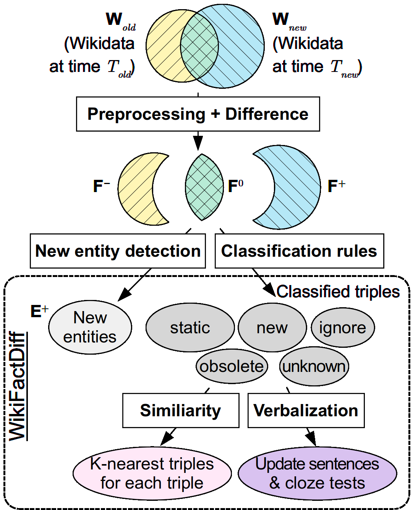

# WikiFactDiff
[<center></center>](./images/build_process.png)

In summary:
- **WikiFactDiff** is a factual knowledge update dataset for LLMs
- It describes the evolution of factual knowledge between two dates $T_{old}$ and $T_{new}$ in the form of semantic triples _(sample below)_.
- The triples are verbalized _(examples below)_.
- <ins>**This repository can be used for two purposes:**</ins>
   - **build** an instance of WikiFactDiff given two dates $T_{old}$ and $T_{new}$.
   - **evaluate** knowledge update algorithms (ROME, MEMIT, MEND, ...) on WikiFactDiff.
- The build process was designed to be easy-to-use. All you have to do is provide $T_{old}$, $T_{new}$, and a folder where to store intermediate files (More details in 1. How to build WikiFactDiff?).
- More details in our paper : Coming soon...

<!-- WikiFactDiff is a dataset designed to perform factual updates within LLMs and to evaluate them. More precisely, it describes the evolution of factual knowledge within Wikidata between two temporal points $T_{old}$ and $T_{new}$ in the form of semantic triples. -->

WikiFactDiff sample (triples only)             |  Templates used for verbalization
:-------------------------:|:-------------------------:
[](./images/sample.png)  |  [](./images/verb.png)

We release the WikiFactDiff dataset for $T_{old} =$ *4 January 2021* and $T_{new} =$ *27 February 2023*, which is ideal to update language models trained using the Pile dataset that was released on December, 31st, 2020. The dataset, named `wikifactdiff.jsonl.xz`, should be decompressed before using it (with the help of the `xz` command).

## 1. How to build WikiFactDiff?
<details>
<summary>Click here!</summary>


### Prerequisites:

#### Software

- OS : Ubuntu 22.04 (not tested on Windows)
- conda (version used : 23.10.0)
- MongoDB (version used : 7.0.3)

### Setup environment
Create and activate the conda environment *wfd_build*
```
bash setup_env/wfd_build.sh
conda activate wfd_build
```

### Configure
1. Specify the folder where all intermediate files will be stored in `build/config.py` by setting the variable `STORAGE_FOLDER`.
1. List the available dates and choose two distinct dates from the output to be $T_{old}$ and $T_{new}$:
   ```
   python build/wikidata_scripts/build_wikidata_dumps_index.py
   ```
1. Specify these two dates in `build/config.py` (using **OLD_WIKIDATA_DATE** and **NEW_WIKIDATA_DATE**) and the MongoDB URL

**NOTE** : Make sure you have the necessary read/write permissions for the storage folder.

### Build WikiFactDiff
[<center></center>](./images/progress.png)

Execute this single command to build WikiFactDiff:

```
python build/wikifactdiff_builder.py
```
It is recommended to run this command in *tmux* or *screen* as it is a very long process.

Assuming the necessary files have already been downloaded, expect **18 hours** for this whole process to finish using a machine with **32 CPU cores, 128GB of RAM, and SSD storage**. You need **210GB** of disk space for the storage folder and **200GB** for MongoDB.

The dataset will be stored in the specified storage folder and it will be named : **`wikifactdiff.jsonl`**.

<details>
<summary>Details of the build process (step-by-step)</summary>

This part breaks down, step-by-step, the internal process of the command **`python build/wikifactdiff_builder.py`**

1. **Download Wikidata dumps**
   ```
   python build/wikidata_scripts/download_dump.py --version old
   python build/wikidata_scripts/download_dump.py --version new
   ```
   **Expected download speed** : ~1MB/s from Internet Archive (old dumps) and ~4MB/s from Wikidata dumps (recent dumps).

   **Dump size** : 50-80GB
   
   **RAM** : Negligeable
2. **Collect Wikipedia views statistics**: These statistics are pushed in MongoDB
   ```
   python build/wikidata_scripts/create_database_wikipedia_statistics.py --version new
   python build/wikidata_scripts/create_database_wikipedia_statistics.py --version old
   ```
3. **Push Wikidata to MongoDB**:
   ```
   python build/wikidata_scripts/process_json_dump.py --version new
   python build/wikidata_scripts/process_json_dump.py --version new
   ```
4. **Preprocess Wikidata dumps**: 
   ```
   python build/wikidata_scripts/preprocess_dump.py --version old
   python build/wikidata_scripts/preprocess_dump.py --version new
   ```

5. **Compute the difference between the two Wikidata versions**
   ```
   python build/wikidata_scripts/compute_diff.py
   ```

6. **Compute the popularity of each entity**
   ```
   python build/wikidata_scripts/compute_importance.py --version old
   python build/wikidata_scripts/compute_importance.py --version new
   ```

7. **Create WikiFactDiff (triples only)**
   ```
   python build/wikidata_scripts/create_wikifactdiff_triples.py
   ```

8. **Setup KNearestTriples**
   ```
   python build/wikidata_scripts/setup_knn.py
   ```

9. **Incorporate verbalizations and KNearestTriples in WikiFactDiff**
   ```
   python build/verbalize_wikifactdiff/verbalize_wikifactdiff.py --ann_method sparse
   ```
</details>

</details>


## 2. How to evaluate with WikiFactDiff?
The evaluation source code (located in `evaluate`) is based on the [MEMIT github repository](https://github.com/kmeng01/memit) from this research paper : [(Meng et al.,2023)](https://arxiv.org/pdf/2210.07229.pdf). Its corresponding MIT licence is located in `evaluate/LICENCE`.
<details>
<summary>Click here!</summary>
A 24GB VRAM GPU (e.g. RTX 3090) is required to run experiments on GPT-J.

### Setup environment
Create and activate the conda environment *wfd_build*
```
bash setup_env/wfd_eval.sh
conda activate wfd_eval
```

### Evaluate


For instance, to evaluate ROME on WikiFactDiff using the GPT-J model, run the following command:
```
cd evaluate
python experiments/evaluate_wfd.py 
   --alg_name ROME 
   --model_name EleutherAI/gpt-j-6B 
   --hparams_fname EleutherAI_gpt-j-6B.json 
   --ds_name wfd 
   --dataset_path WIKIFACTDIFF_PATH
   --results_dir RESULT_PATH 
   --continue_from_run run_000
```
Specify the path to the WikiFactDiff dataset `WIKIFACTDIFF_PATH` and the desired result folder `RESULT_PATH`.

**NOTE**: Only replacement updates are evaluated since existing algorithms can only handle this update scenario (no oblivion, entity insertion, etc.).
</details>

## How to cite?
Coming soon...

## Having issues using our code?
Please let us know by opening an issue o
